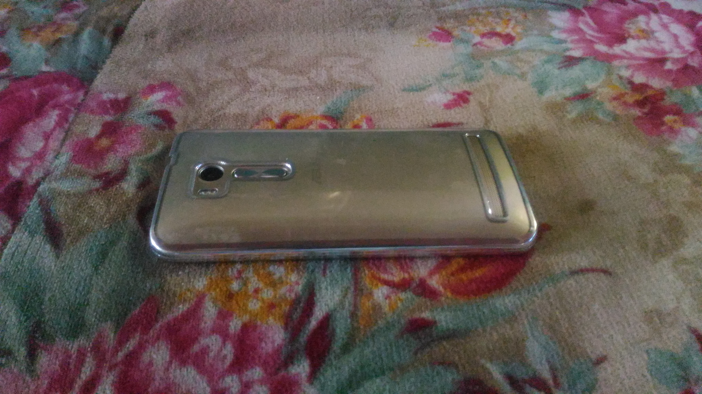
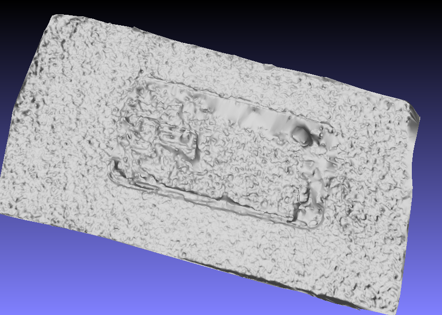
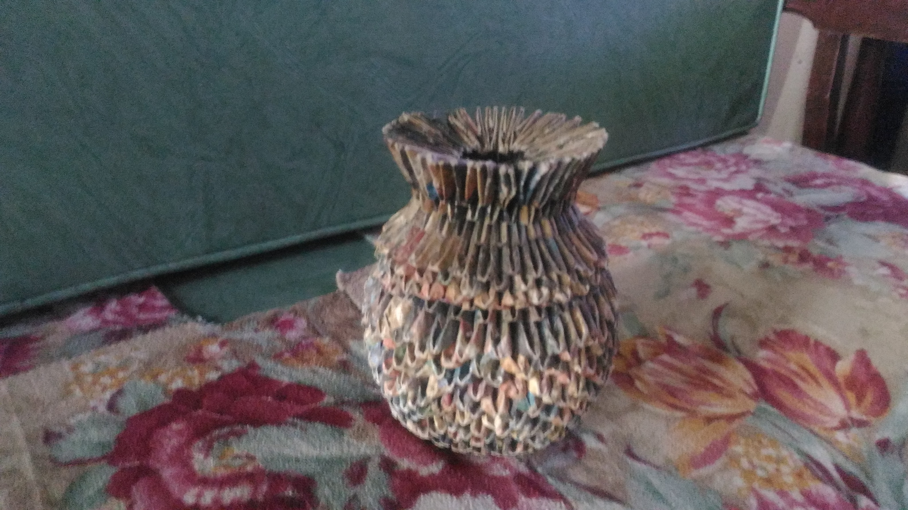
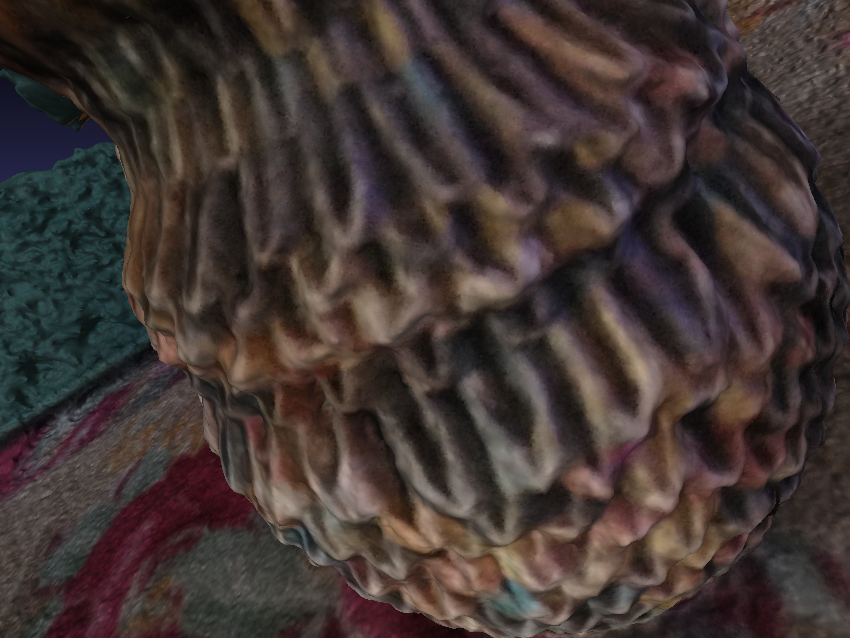
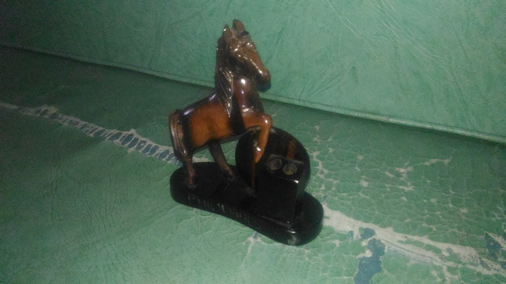
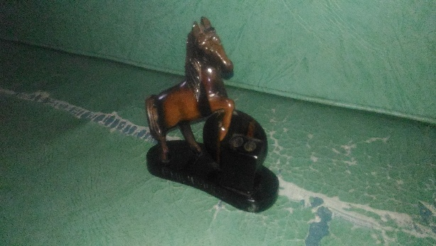
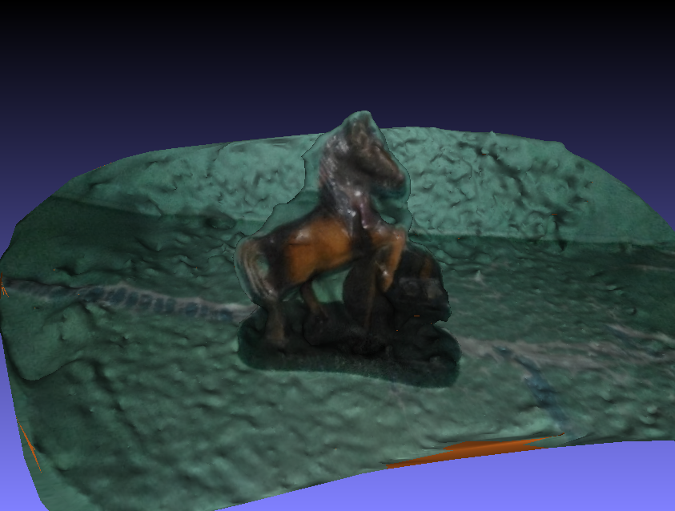
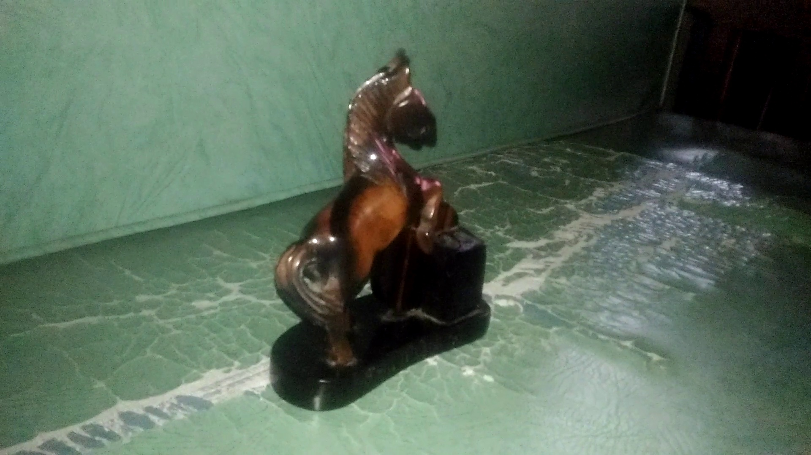

# Week 10
#### (October 9, 2017 to October 13, 2017)

Finally, I was able to install OpenMVS in the other computer. The problem was that the version of OpenCV that I initially installed does not match with the needs of OpenMVS given Ubuntu 16.04 as the OS. With that, I was able to pursue other models. After that, I tried modeling the horse sculpture (1) using images, and (2) using a video. Both with flash because the sculpture is dark, and other colors will not be visible until I do that. I also started with the paper, although I am not sure with the format.

#### Continuation of other models
Last time, I tried to model several objects to see the limitations. Here are the continuation of some of them:

##### Transparent to very shiny surface

Mesh:

As I have suspected, this kind of surface are not modeled properly. In this sample, the parts with such surface is presented as hollow.

##### Pattern
I was able to reach the mesh for this, but I was really curious with the textured version.

With Texture:

When the surface has obvious texture, the model is better. It is safe to say that objects with texture, or even just print on the surface are modeled nearer to their original form.

#### Horse Sculpture
I'll only show the final models on this one.
Original:

Model:

Lowered Quality:

Model:

As expected, the model was created. Lowering the quality of the images to 614 x 346px still created a model, but notice that there were few details this time. I lowered the quality once more, but a model is not created. Strangely, the specs still says _614 x 346px_ in the latest one.

Next, I tried to take a [video](../Trials/images/horsev/horse.mp4). I only saved images every five frames because saving all frames would take forever to model, and some of them looks practically the same. Here's a sample frame

Sadly, a model was not created. I honestly do not know why. These images are 1920x1080px, higher than the other set of pictures I used previously, yet was able to generate a model.

#### Paper
I checked out [ICS' LaTex template](http://www.ics.uplb.edu.ph/files/CS190_LaTeX.zip), and it was very helpful, except that this is a template for an actual SP, not a proposal. A proposal is usually up to the _Methodology_ chapter only, but there may be additional headings, like timetable and bugdet plan, such as how it was in the [format](www.up.ac.za/media/shared/Legacy/sitefiles/file/40/753/template.doc) that was given to us in ENG 10; although that was for a research proposal. In addition, there may be subheadings that I have to include/remover. I'm guessing ICS has a specific format for SP proposals. For now, [here](../LaTex/cantimbuhan-cs190-ieee.pdf) is what I have worked on. I am unsure with the title yet. I do not know if I should focus on the libraries that I used, or on the purpose (sculpture) part. For other portions of the initial work, I have only included notes on what I am planning to put.
