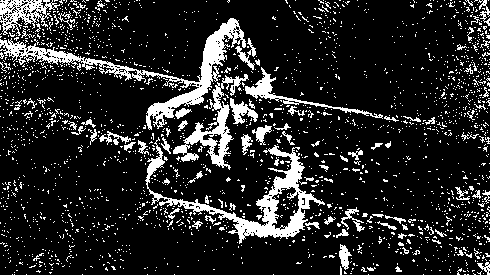
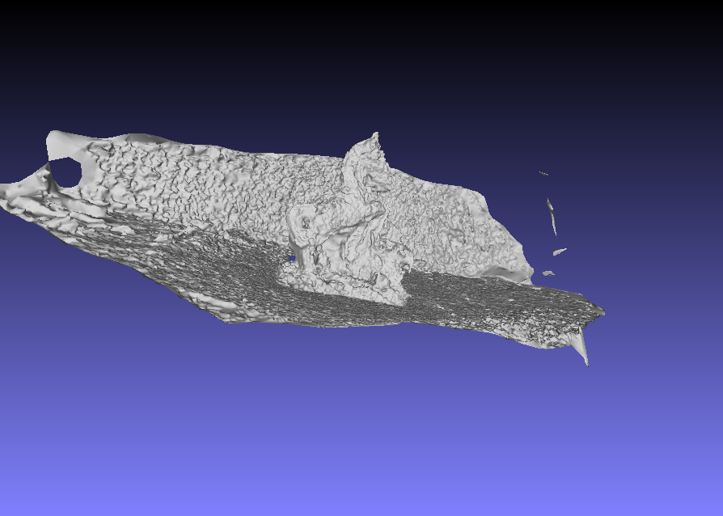
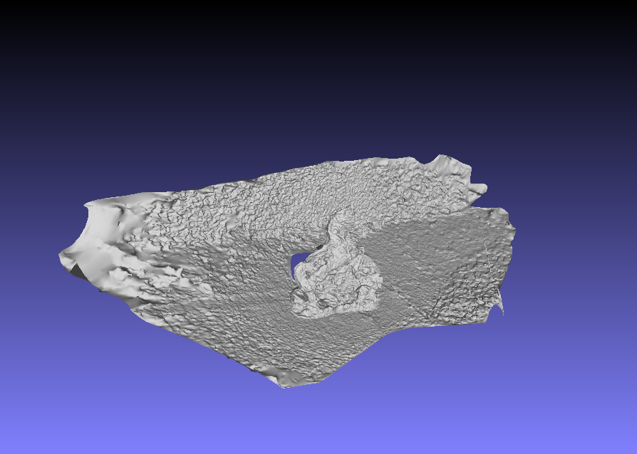

# Week 11
#### (October 16, 2017 to October 20, 2017)

I was only able to try two things this week: (1) fewer number of pictures, (2) masking.

#### Fewer pictures
For obvious reasons, few and good quality pictures work best with OpenMVG + OpenMVS. "Few", meaning 15 to 20 pictures. Up to before today, I was using aroung 50 to 70 photos to get the best results. Some of the photos in those are blurry, so not all of them are used anyway. Point is, making sure that you're feeding the program the best photos it can get makes a difference.

#### Masking
OpenCV provides background reduction functions that I can use for this. Following this [tutorial](https://docs.opencv.org/3.3.0/db/d5c/tutorial_py_bg_subtraction.html) did help (although I had to translate the sample codes to C++). But unlike those in the website, I got this:

I tried poking around the threshold, but it does not give me the result I wanted. I'll look into this more. I used the generated masking to model the horse with the same photos. It reduced the modelling time, and the densified model's points was reduced from 1908326 to 1862050.

Models differ very slightly (maybe because of the poor masking), but notice that the _floating_ portions in the first model was removed.

As a sample of both things I tried, I cut down last week's photos to 13, and used masking (this is not the one I'm expecting yet). Modelling took only about five minutes, and it gave the following result:

Notice that a big portion of the unnecessary background was removed.

For algorithm improvement, maybe something could be done to model the transparent portion of the object as well, instead of it being hollow. I am also looking into making the computation faster internally.
