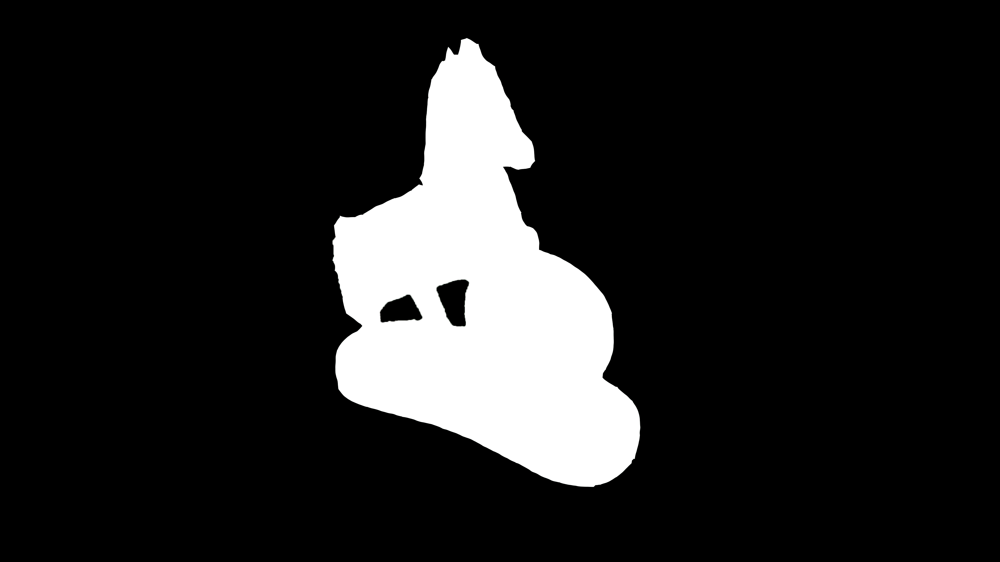
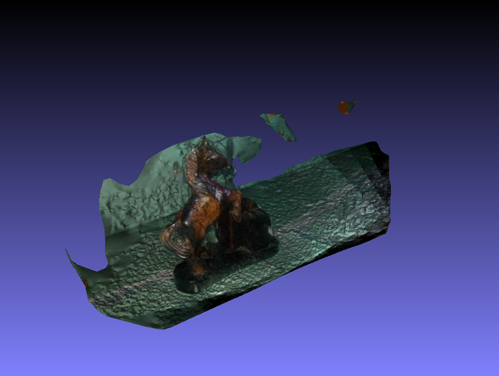
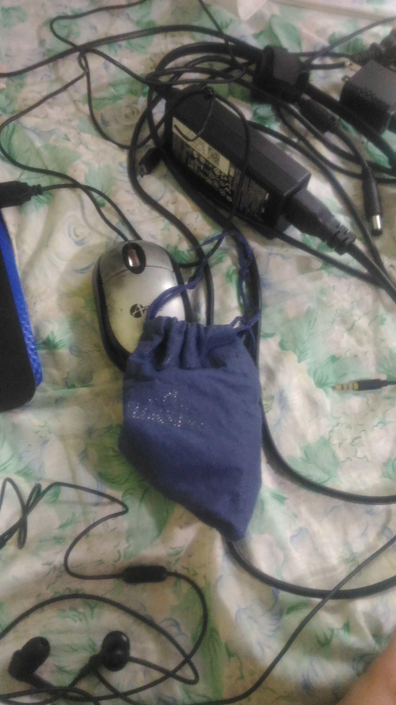
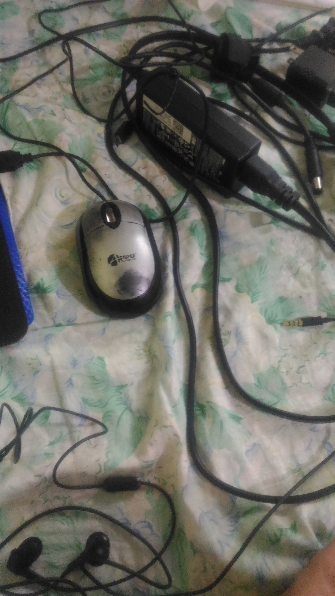
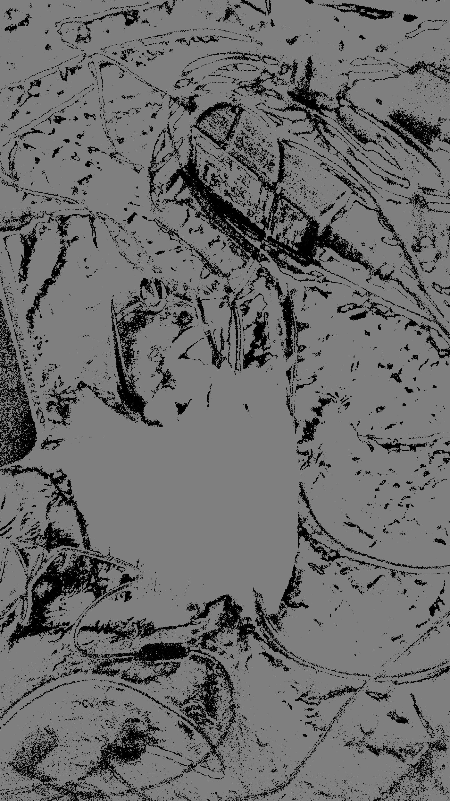

# Week 12
#### (October 23, 2017 to October 27, 2017)

This week is focused on masking experiments and the paper.

#### Masking
As suggested in the last consultation, I tried to mask the images manually:

Desified point cloud is reduced from 347,462 points to 329,895. Timewise, the new masking is 18995 ms faster in this part. As expected, background portion is cut down even more:

Using the mask last week

Using the mask I manually created

I looked up ways to do the masking. Most of what I have found lean towards object detection, which will require AI. Meaning, this calls for a different project. There is another way, which is background subtraction by OpenCV. This uses the same functions I used last week, except that this time, there is a background model where the program will base on.

Background Model

Image

Mask

As we can see, the blue bag is successfully subtracted. The problem here is that it is impossible in my current setup to capture two versions of the same view. The easiest way to do it is having many cameras mounted in desired angles, taking photos, removing the object, then taking photos once more. It will be a tedious task for users (tedious and currently impossible task for me).

#### Paper
I am already done up to the Literature Review. I am now trying to breakdown the libraries' source code to look for possible improvements in their current state. I have revisited a [paper](Documents/3D_RECONSTRUCTION_USING_PHOTO_CONSISTENCY_FROM_UNCALIBRATED_MULTIPLE_VIEWS.pdf) where camera calibration and pose estimation is not used. These two eats a lot of time in the reconstruction process, and the possibility of eliminating them would probably greatly decrease process time. It will take me at least until Monday to see if I can make it happen.
