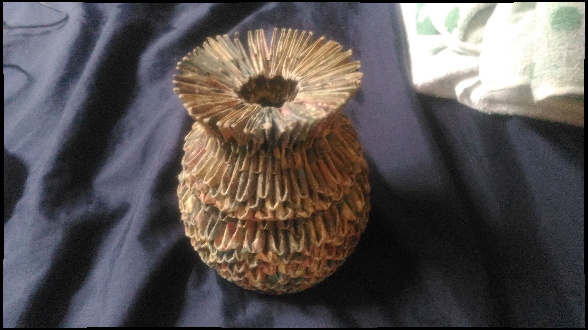
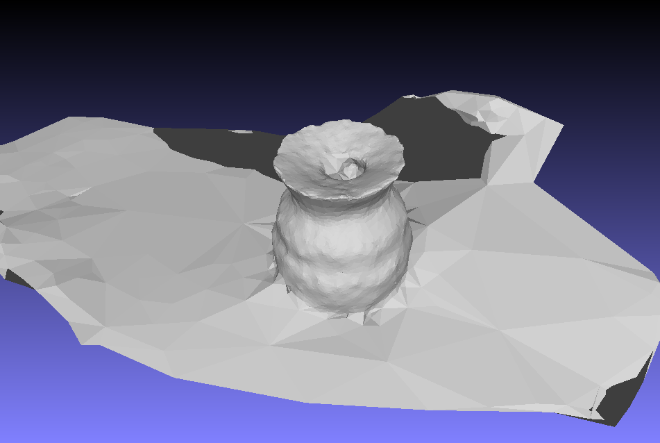
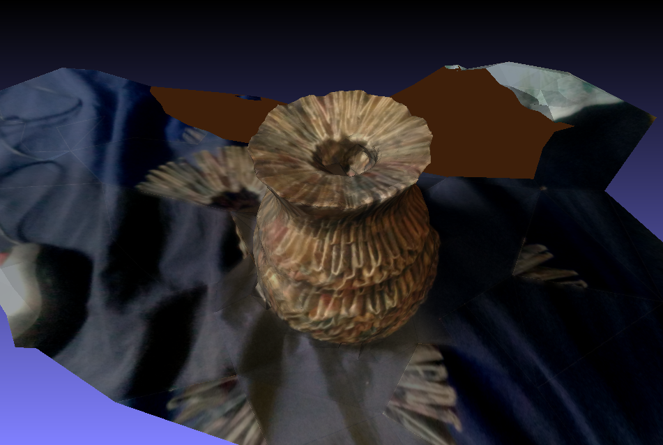
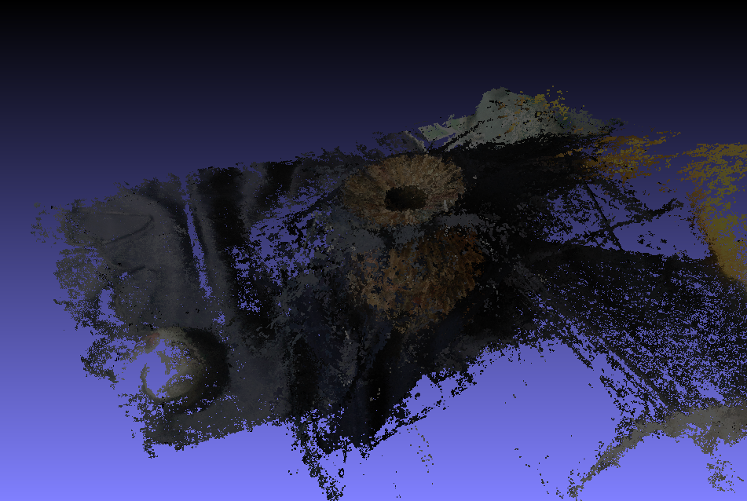
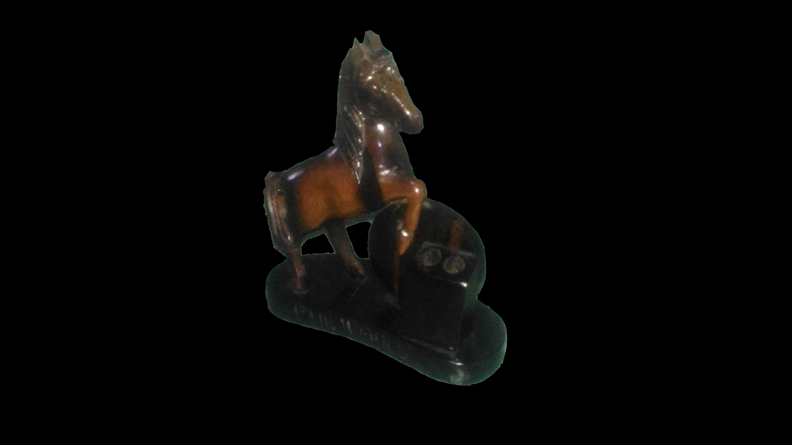

# Week 13
#### (October 30, 2017 to November 3, 2017)

#### 360 Model
Since I am still havig troubles with the set up in the horse sculpture, I used the paper arrangement for this week's model.
Image sample:


Mesh:


With texture:


The texture is bizarre and the mesh is a bit _rocky_ because this is model skipped the dense point cloud stage. Looking at the dense point cloid, it is pretty obvious that there are way too much noise. In addition, the reconstruct mesh stage keeps on getting ```floating point exception``` error from here. According to the developer of the library, it may be due to the gcc version, as said [here](https://github.com/cdcseacave/openMVS/issues/210).


#### Paper
I have added the 3D reconstruction in the methodology. The Literature Review chapter seemed short because there are a lot to be discussed in the methodology. In fact, some steps are oversimplified because the paper would be incredibly long and complicated if I included everything. Looking at the current stage, if all of the things I have written will be included in the SP, I might surpass the recommended number of pages, which is six.

#### Masking Discovery
Apparently, the masking I presented last time was wrong. I read the source code slowly this week, and I found out that I named the mask images wrong. I used ```imageName.jpg_mask.png``` before since I created a program to generate the first set of mask. Because there was a change in the number of points in the point clouds, I thought that that was the right naming, and I just followed that even in the manual masking. Turns out, it must be ```imageName_mask.png```. When I ran the program once more with the correct mask names, a model with less views was created for the first set, and none was created in the second set (manual).

This supports the results I had when I applied the mask to the images like this:


There was no model reconstructed using this image.
