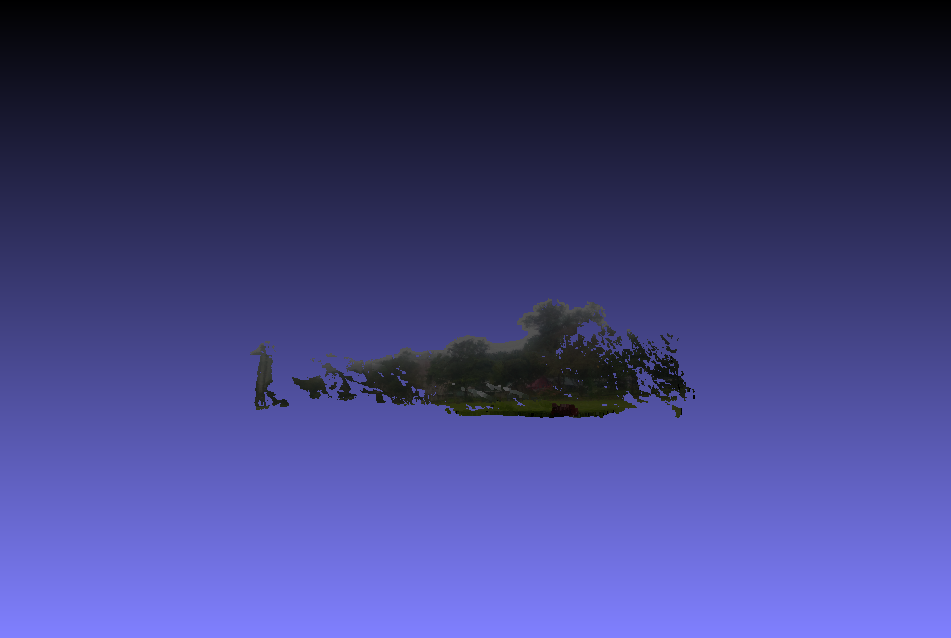
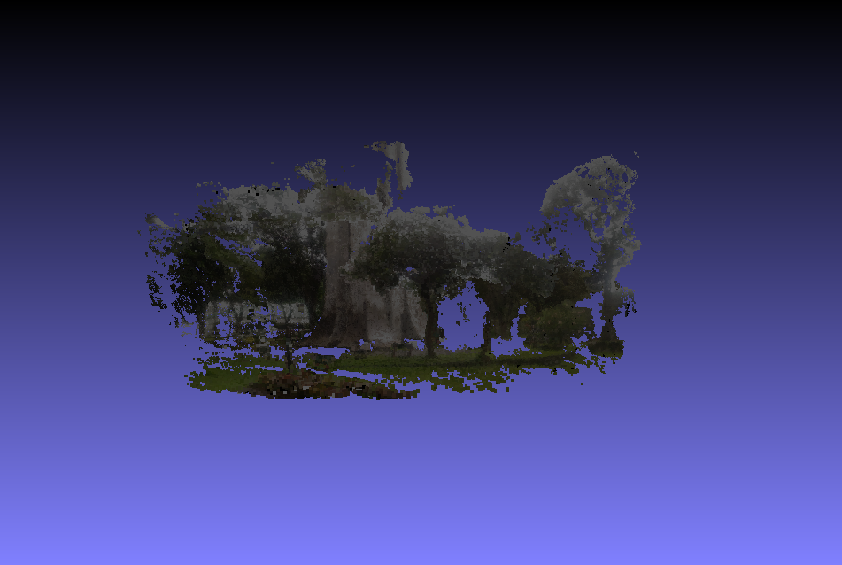
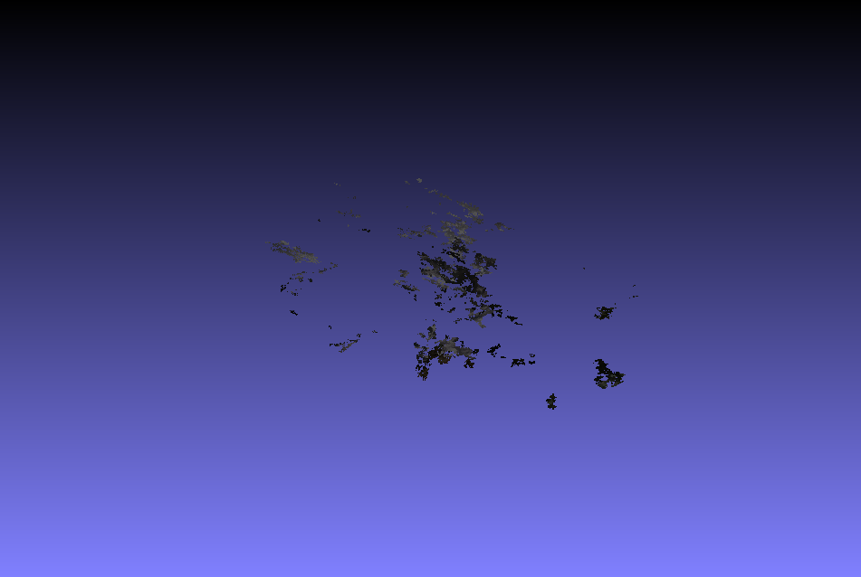
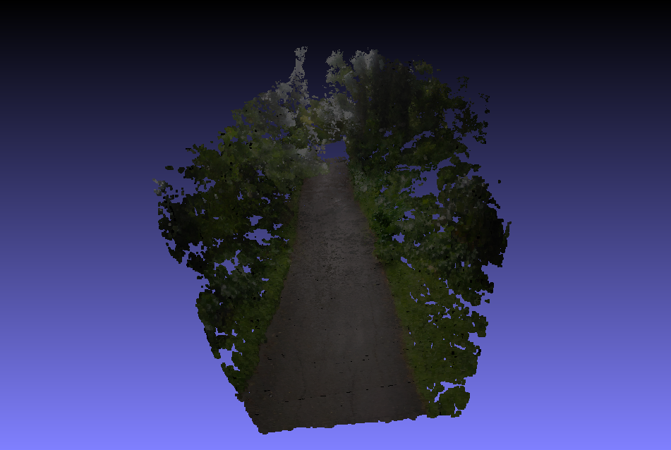

# Week 14
#### (November 6, 2017 to November 10, 2017)

#### Landmarks
Below are the models that have been reconstructed during the past week:
FPark

Carillon Tower1

Carillon Tower2

Marya Fountain

Carillon Tower1

Trail

Since I could not get the right position, these models do not look good, especially the one for Marya Fountain. In addition, all of these never got to the creation of mesh because the points are too scattered, even with the densified 3D point cloud. Photos does not look good in some angles as well, and I could not do much about that because these are outdoor images. I'd have to make extra effort such as to setup some things around the object to get better photos. Here's a sample of a bad photo:

As we can see, the image is too bright, making it look smudged. Although, it's worth noting that the outdoor images that I have taken this week are mostly, if not all, undistorted. Calibrated photos from the start makes the reconstruction faster. Unlike before that the problem is the distorted images, this time, the problem lies on the number of matches the program finds. Since I do not have the luxury to be on the ideal position to take photos, each feature does not appear as much as it should.

#### Paper
I have moved the previous work to a [Google Document file](https://docs.google.com/document/d/1dK50fJs14ucYq_ry4XEmo5w4tn6QTAlSPpcA0-DoOUg/edit?usp=sharing). I have added more detail to some algorithms. I wanted to explain them in depth, but I'm afraid the proposal will become too long, so I only provided short explanations on what they do. Unfortunately, there seem to be a format problem between the OBJ files generated in the program and the OBJ files that BabylonJS accepts. If I would not be able to find the problem next week, I might switch to Three.js or other framework.
