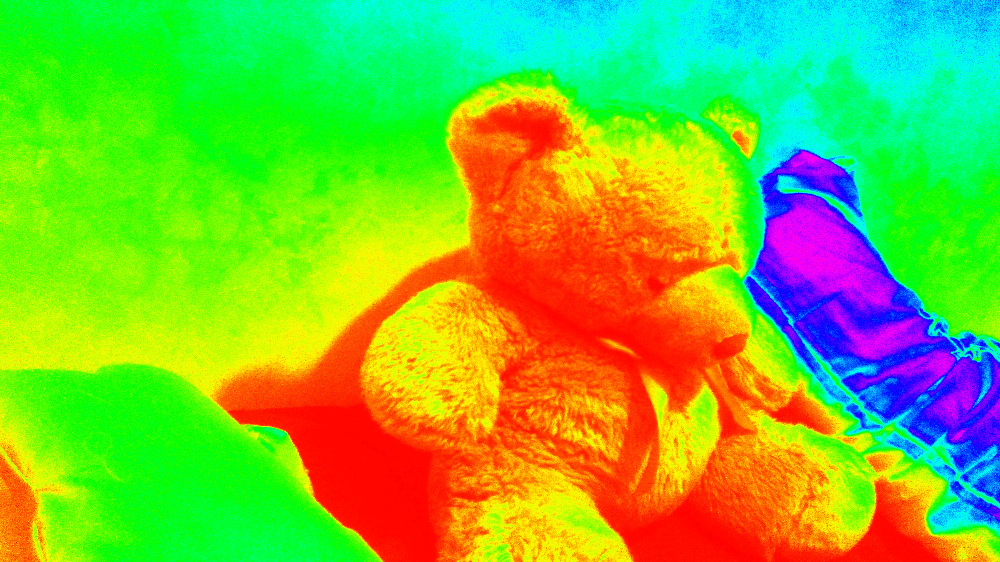
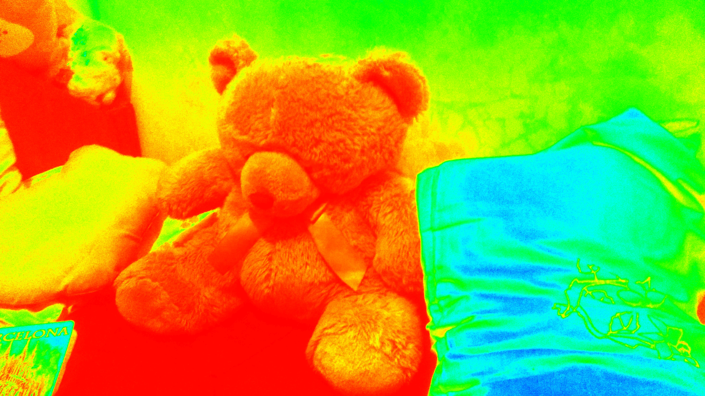
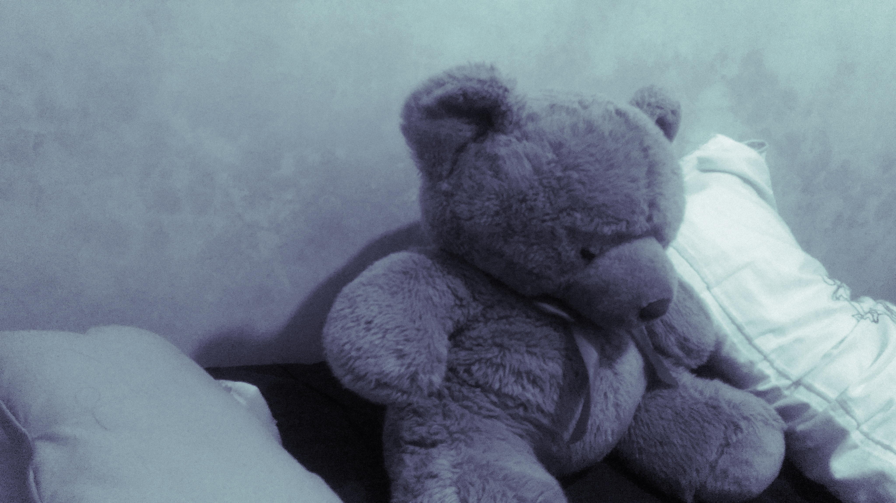
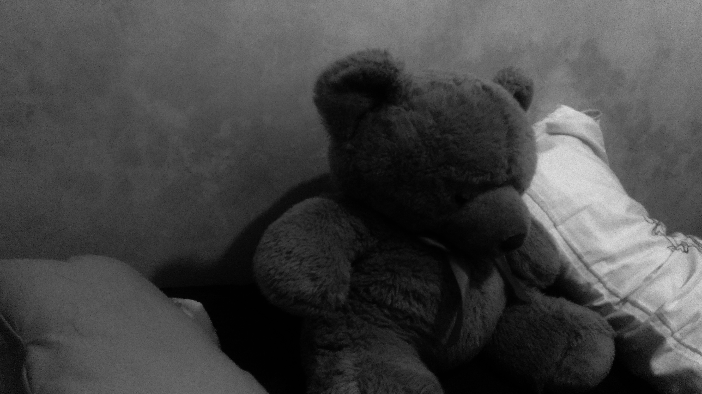
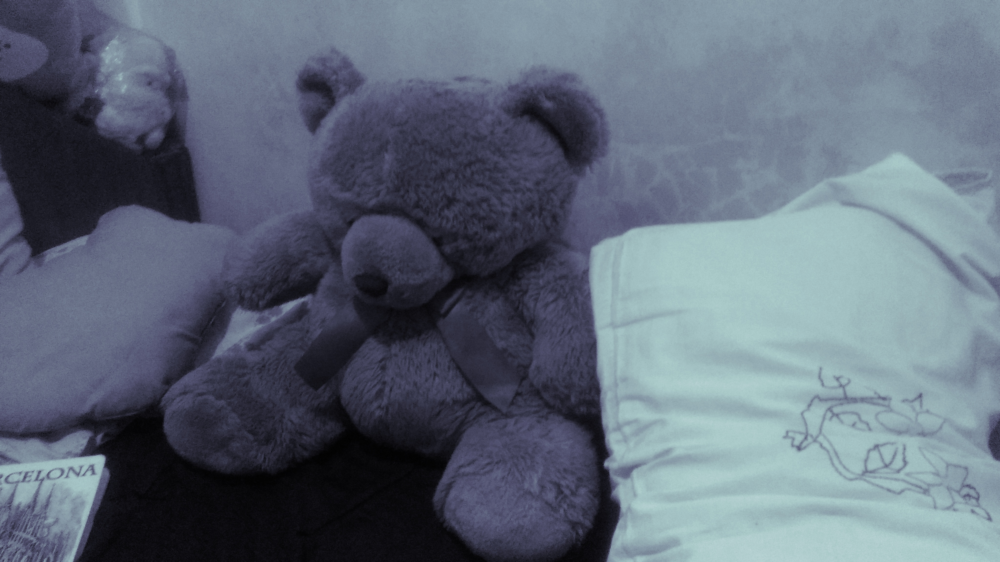

# Week 9
#### (October 2, 2017 to October 6, 2017)

For this week, I acquired access to a computer with better specs than my laptop, except that I could not build OpenMVS properly. It keeps looking for ```libtiff4-dev```, but Ubuntu 16.04 (the other computer's OS) does not support this anymore. That's why I have not tried modelling using that computer yet.

On another note, I have tried to "recolor" the monochrome pictures, to see if these photos can go further than SfM point cloud. I also looked for sculptures specific in Paete, Laguna. But there were no photos that will fit the requirements. Surprisingly, I was able to find [dataset](http://redwood-data.org/3dscan/index.html) with several objects, including sculptures. The problem is that the photos are from a video recording with low quality. I'll tackle these one by one:

#### Monochrome Photos
There are no readily available libraries on recoloring images. According to what I've read, grayscale images, even when processed with OpenCV's [cvtColor()](http://docs.opencv.org/2.4/modules/imgproc/doc/miscellaneous_transformations.html), does not magically acquire its original colors. These images lack these colors. If someone wants to color them, suggesting colors is needed, or a prior knowledge by the computer is needed, just like this [one](https://news.developer.nvidia.com/easily-colorize-black-and-white-photos-with-ai/).

So I gave up the idea of getting the original color of the image. Using OpenCV, I used [applyColorMap()](http://docs.opencv.org/3.1.0/d3/d50/group__imgproc__colormap.html). I have tried several color maps, but I'll focus on two:
* ##### COLORMAP_HSV
  
  
  For a moment, I actually thought that I might be okay with this mapping. The bear's color is separated from the pillow.
  
  
  
  But in this photo, the colors are not consistent anymore. See that the bluish part in the pillow has faded. This change is too much, which might cause the program to not be able to see them as one object. With that, modelling using these photos is a failure.
  
* ##### COLORMAP_BONE
  
  
  This color map is very close to the monocrome version in terms of the lack of other colors:
  
  
  But keep in mind that the photo has become clearer compared with the monochrome one. below is
  
  
